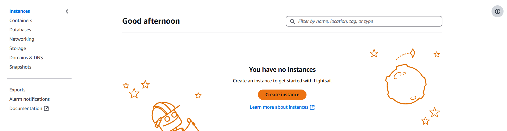

# Project-1 WordPress on AWS Lightsail

AWS Lightsail is a cost-effective and beginner-friendly platform for deploying applications, including WordPress. Lightsail simplifies cloud hosting by providing pre-configured virtual private servers (VPS), making it ideal for WordPress blogs.

## Steps to Deploy WordPress on AWS Lightsail

### 1. Sign in to AWS and Navigate to Lightsail

- Go to AWS Lightsail Console.
- Click on "Create instance" to set up a new server

### 2. Choose an Instance Location

- Select the region closest to your target audience for better performance.

### 3. Select an Instance Image

- Choose "Apps + OS", then select WordPress (which comes pre-installed).

### 4. Choose an Instance Plan

- Choose $5 plan asthis isgoing to be just small practical.

### 5. Name and Create the Instance

- Give your instance a meaningful name (e.g., my-wordpress-blog).
- Click "Create instance", and wait for AWS to provision it.

Once created you will see instance featues like this:

### 6. Access Your WordPress Site

- Once the instance is running, go to the Networking tab in Lightsail.
- Copy the public IP address and paste it into your browser to open your WordPress site.

### 7. Retrieve WordPress Admin Credentials

- Connect to your instance using SSH (Click “Connect using SSH” in Lightsail).

Run the following command to get your WordPress admin password:
`cat bitnami_application_password`

- Note the password and use it to log in at http://your-public-ip/wp-admin/.
- Default username is 'user' when you create wordpress server using this Lightsail way.

Complete the login and use Wordpress to blog your content.

This setup can help anyone to try Lightsail and its inbuilt feature to use Wordpress server. If someone wants to keep using this server can assign static IP to it and start blogging easily. Keep in mind we have used $5/month plan that is free just for 90 days.
