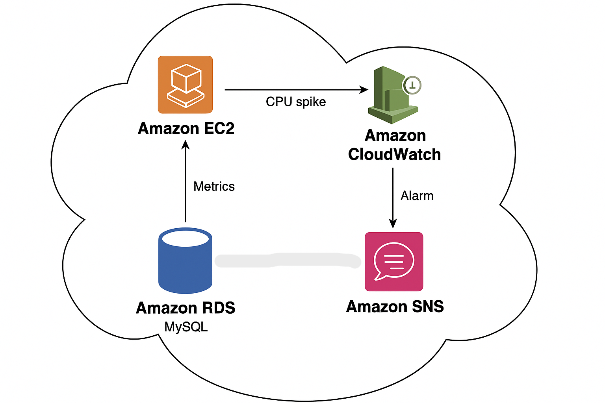

# 📈 RDS Cloud Monitoring & Alerts using CloudWatch + SNS

This project demonstrates how to monitor an Amazon RDS (MySQL) instance using Amazon CloudWatch and set up automated alerting through Amazon SNS. It’s built entirely using AWS Free Tier and simulates high CPU load from an EC2 instance to trigger CloudWatch alarms.

---

## 🚀 Project Overview

- ✅ **RDS (MySQL)** setup using Free Tier
- 📊 **CloudWatch Alarm** on `CPUUtilization`
- 🔔 **SNS Topic** for email notifications
- 🖥️ **EC2 (Ubuntu)** instance to simulate load using SQL `BENCHMARK()` command
- 📬 Real-time **email alert** when CPU usage threshold is crossed

---

## 🧱 Architecture

[RDS+CloudWatch Project](./RDS+CloudWatch%20Project.docx)

---

## 🪜 Step-by-Step Setup

Refer the document to see step by step setup and output.

## 🎯 What I Learned

- How to monitor key RDS metrics using CloudWatch
- How to simulate real-world load for testing alerts
- How to configure SNS topics and subscriptions
- How to tie multiple AWS services together into a functional DevOps flow

## 🧹 Post-Project Cleanup

To avoid unnecessary charges:

- Terminate EC2 and RDS instances
- Delete SNS topics and CloudWatch alarms
- Disable detailed monitoring (if enabled)

---

## 👤 Author

**Ajinkya Pame**  
🌐 [LinkedIn](https://www.linkedin.com/in/ajinkya-pame-4a752b346)

⭐ If you found this project useful, feel free to star the repo and connect!
