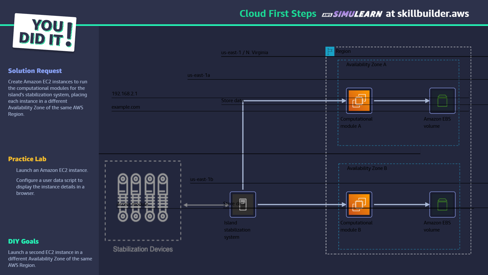

# AWS SimuLearn: Cloud First Steps – Task Completion

I have successfully completed the **AWS SimuLearn Cloud First Steps** task available at [AWS SimuLearn Cloud First Steps AWS Skill Builder](https://explore.skillbuilder.aws/learn/courses/20232/aws-simulearn-cloud-first-steps).

## 📘 Course Overview

This SimuLearn experience provided a guided, hands-on introduction to core AWS services using a simulated AWS environment. It offered a practical foundation for working with AWS infrastructure in a safe, no-risk setting.

## 🎯 Learning Objectives

- Identify AWS infrastructure benefits
- Describe AWS Regions and Availability Zones
- Demonstrate how to deploy Amazon EC2 instances into multiple Availability Zones

## ✅ Task Architecture

## Steps:

1. Identify the architecture in first step by Scripted format or AI chat with customer.
2. Learn the theorotical part.
3. Start next step and download the user-data file looking something like [user-data.txt](./simulearn/user-data.txt) on desktop and upload while launching the instances.
4. Launch an instance along learning step with steps mentioned in that. It shows output like this html page [html-page.html](./simulearn/html-page.html).
5. In DIY section launch another instance as per mentioned in task objective. Make sure this instance is launched in different availability zone.
6. Validate the answer by entering both the instance IDs.
   
7. Submit the task and a completion window will appear like this:
   

_This task is part of my ongoing journey to build expertise in AWS and cloud computing. Feel free to explore my other projects or connect with me!_
